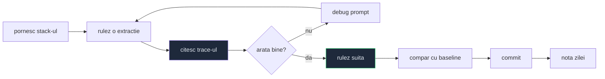

# MOC Operații zilnice

Parte din [[MOC AI Engineer]]. Ce fac efectiv într-o zi — rutine, nu teorie.

## Ziua, în ordine

## Rutine

- [[Fluxul zilnic de evaluare]] — de la stack pornit la verdict
- [[Cum citesc un trace]] — `finish_reason` întâi, restul după
- [[Debugging un prompt]] — un lucru schimbat o dată, pe același set
- [[Versionarea prompturilor]] — promptul e cod: git, versiune, teste

## Metodă

- [[Experiment inainte de concluzie]] — reproductibilitatea arată că _există_ o cauză, nu _care_ e
- [[Inregistrare si reluare in teste]] — iterezi pe graderi gratis, fără rețea

## Cu agenți

- [[Lucrul cu agenti in terminal]] — nodul care leagă codul de agenți
- [[Claude Code - configurare]] — `CLAUDE.md`, `rules/`, hooks, agenți, MCP

## Înainte să crezi un rezultat

1. **A rulat pe infrastructură sănătoasă?** Proxy căzut → 8 din 9 joburi eșuate nu e rezultat, e zgomot
2. **E reproductibil?** O rulare e anecdotă, patru la rând e semnal
3. **Semnalul e verificabil?** Un verde pe un criteriu care nu se poate verifica e mai rău decât un gol —
   vezi [[Esecul tacut in sisteme AI]]

## Legat

- [[MOC Stack AI]] — uneltele · [[MOC Sedinte]] — ce s-a decis
- [[Metrici pentru agenti AI]] — ce măsori la final
