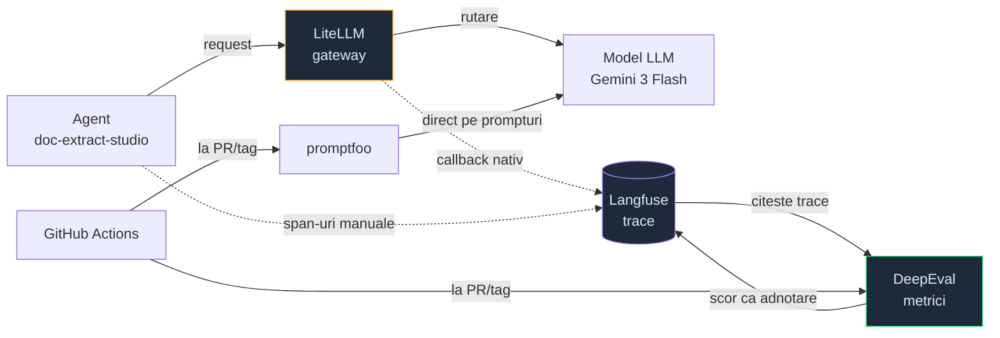

# MOC Stack AI — unelte

Parte din [[MOC AI si LLM]]. Uneltele pe care le folosesc **efectiv**, nu ce e la modă.
Extrase din `qa-ai-agent` și `ecf_app_web-doc_extract_studio`.

## Cum se leagă

**Cheia:** Langfuse e sursa de adevăr. DeepEval nu o înlocuiește — citește trace-ul, notează,
scrie scorul înapoi ca adnotare. promptfoo e pe alt fir: testează prompturi și modele direct,
fără trace-uri de producție.

## Unelte de LLM

- [[LiteLLM - gateway pentru modele]] — un singur API peste toți furnizorii
- [[Langfuse - tracing pentru LLM]] — unde ajung prompturile, costurile, pașii
- [[DeepEval - evaluare automata]] — metricile care produc verdictul
- [[promptfoo - teste pe prompturi]] — YAML peste prompturi, fără infrastructură
- [[MCP - Model Context Protocol]] — cum dai unui model acces la unelte reale

## Unelte de zi cu zi

- [[uv - pachete Python rapid]] — înlocuiește pip/venv/poetry
- [[Lucrul cu agenti in terminal]] — Claude Code și disciplina din jurul lui
- [[Docker layer caching]] · [[Cozi si background jobs]] — Celery + Redis, la doc-extract

## Stack-ul aplicației evaluate

`ecf_app_web-doc_extract_studio`: FastAPI + uvicorn · SQLAlchemy async + asyncpg · Alembic ·
Celery + Redis · Pydantic v2 · PyMuPDF/pikepdf · openai SDK · langfuse · fastmcp.
Docker Compose: postgres, redis, migrate, backend, celery-worker, celery-beat, frontend.

`qa-ai-agent`: uv · pyyaml · `datasets/` `evals/` `generators/` `promptfoo/` `stack/` `baselines/`

## Legat

- [[QA AI Agent]] — proiectul unde se folosesc toate
- [[Metrici pentru agenti AI]] · [[Tracing LLM - spans si context]]
- [[MOC DevOps si Deploy]] · [[MOC Python]]
