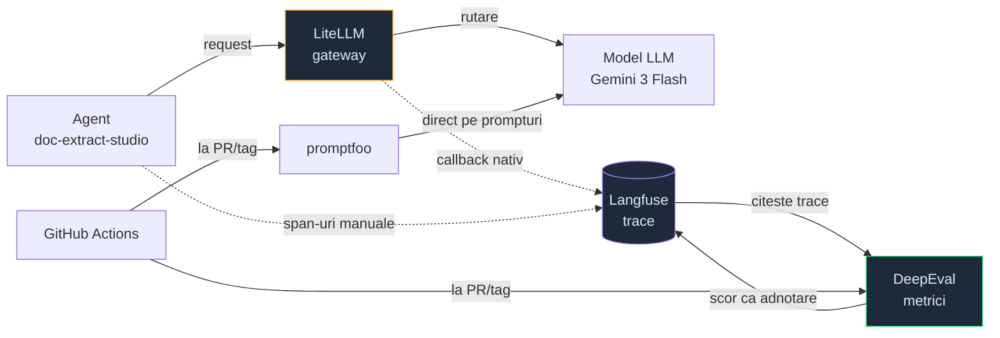
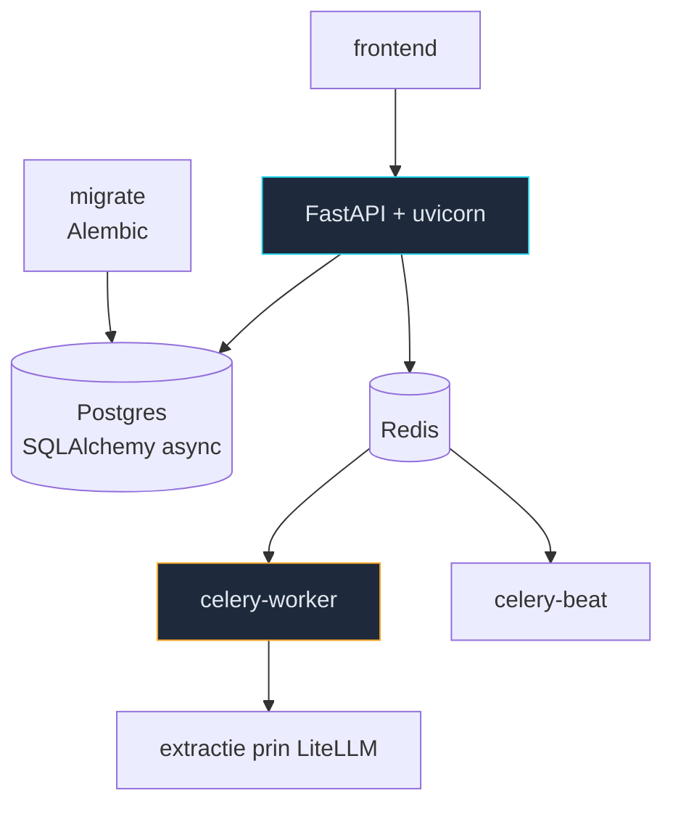

# MOC Stack AI

Parte din [[MOC AI Engineer]]. Uneltele pe care le folosesc **efectiv**, extrase din
`qa-ai-agent` și `ecf_app_web-doc_extract_studio` — nu ce e la modă.

## Cum se leagă

**Cheia:** Langfuse e sursa de adevăr. DeepEval nu o înlocuiește — citește trace-ul, notează,
scrie scorul înapoi ca adnotare. promptfoo e pe alt fir: prompturi și modele direct, fără
trace-uri de producție.

## Lanțul de LLM

- [[LiteLLM - gateway pentru modele]] — un singur API peste toți furnizorii
- [[Langfuse - tracing pentru LLM]] — unde ajung prompturile, costurile, pașii
- [[DeepEval - evaluare automata]] — metricile care produc verdictul
- [[promptfoo - teste pe prompturi]] — YAML peste prompturi, fără infrastructură
- [[MCP - Model Context Protocol]] — acces la unelte reale

## Aplicația evaluată

- [[FastAPI - API async]] · [[Pydantic v2 - validare la boundary]]
- [[Celery si Redis - joburi asincrone]] · [[Alembic - migrari de schema]]
- [[Docker Compose - stack local]] — cele 7 servicii

## Python, zi cu zi

- [[uv - pachete Python rapid]] — înlocuiește pip, venv și poetry

## Legat

- [[MOC Operatii zilnice]] — ce faci cu uneltele astea
- [[QA AI Agent]] — proiectul unde se folosesc toate
