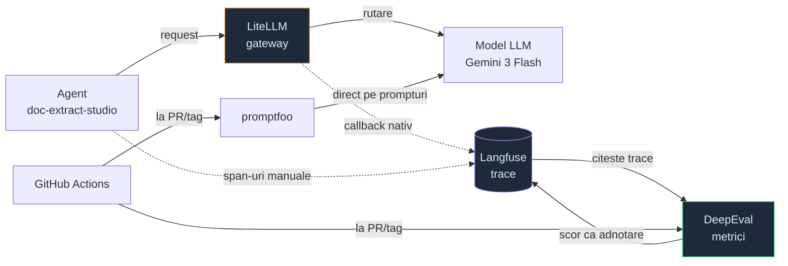
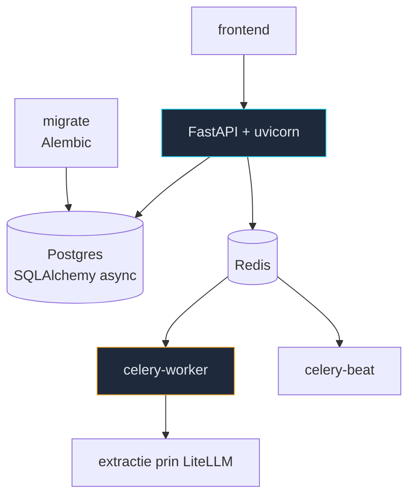

# MOC Stack AI

Parte din [[MOC AI Engineer]]. Uneltele pe care le folosesc **efectiv**, extrase din
`qa-ai-agent` și `ecf_app_web-doc_extract_studio` — nu ce e la modă.

## Cum se leagă

**Cheia:** Langfuse e sursa de adevăr. DeepEval nu o înlocuiește — citește trace-ul, notează,
scrie scorul înapoi ca adnotare. promptfoo e pe alt fir: prompturi și modele direct, fără
trace-uri de producție.

## Lanțul de LLM

- [[LiteLLM - gateway pentru modele]] — un singur API peste toți furnizorii
- [[Langfuse - tracing pentru LLM]] — unde ajung prompturile, costurile, pașii
- [[DeepEval - evaluare automata]] — metricile care produc verdictul
- [[promptfoo - teste pe prompturi]] — YAML peste prompturi, fără infrastructură
- [[MCP - Model Context Protocol]] — acces la unelte reale

## Aplicația evaluată

- [[FastAPI - API async]] · [[Pydantic v2 - validare la boundary]]
- [[Celery si Redis - joburi asincrone]] · [[Alembic - migrari de schema]]
- [[Docker Compose - stack local]] — cele 7 servicii

## Python, zi cu zi

- [[uv - pachete Python rapid]] — înlocuiește pip, venv și poetry

## Traseu de învățare

Fiecare notă are o secțiune **`## Cum învăț asta`**: documentația oficială, un prim pas practic
de ~30 de minute cu comenzi reale, ordinea în care merită citit și capcana de începător.

Ordinea de mai jos nu e alfabetică — e **dependența reală**. Fiecare treaptă e utilă și singură,
dar următoarea are sens doar după ea.

| #   | Ce                                     | De ce aici                                       | Deblochează                        |
| --- | -------------------------------------- | ------------------------------------------------ | ---------------------------------- |
| 1   | [[uv - pachete Python rapid]]          | fără mediu reproductibil, restul e loterie       | orice proiect Python               |
| 2   | [[Pydantic v2 - validare la boundary]] | contractul dintre tine și date                   | FastAPI, validarea output-ului LLM |
| 3   | [[FastAPI - API async]]                | aplicația evaluată e construită pe el            | citirea codului agentului          |
| 4   | [[Docker Compose - stack local]]       | fără stack pornit, nu poți rula nimic            | Langfuse, Postgres, Redis          |
| 5   | [[LiteLLM - gateway pentru modele]]    | punctul prin care trec toate apelurile           | schimbarea modelului fără cod      |
| 6   | [[Langfuse - tracing pentru LLM]]      | **treapta-cheie** — fără trace nu poți măsura    | tot ce ține de evaluare            |
| 7   | [[DeepEval - evaluare automata]]       | transformă trace-ul în verdict                   | metricile automate                 |
| 8   | [[promptfoo - teste pe prompturi]]     | fir paralel, nu depinde de 6-7                   | iterat rapid pe prompturi          |
| 9   | [[Celery si Redis - joburi asincrone]] | extracția rulează ca job, nu în request          | debugging pe calea reală           |
| 10  | [[Alembic - migrari de schema]]        | schema desincronizată dă erori care par de model | rulări curate                      |
| 11  | [[MCP - Model Context Protocol]]       | ultimul: are sens după ce știi tool use          | agenți cu unelte reale             |

**Dacă ai o singură după-amiază:** 1 → 4 → 6. Mediu, stack pornit, un trace citit. Restul se
construiește peste asta.

**Regula care se aplică la toate:** citește documentația _după_ ce ai rulat primul exemplu, nu
înainte. Altfel memorezi termeni fără să ai unde să-i pui.

## Legat

- [[MOC Operatii zilnice]] — ce faci cu uneltele astea
- [[QA AI Agent]] — proiectul unde se folosesc toate
- [[Cum testez un agent nou]] — stackul de mai sus, aplicat la un agent care nu e „Extracție"
